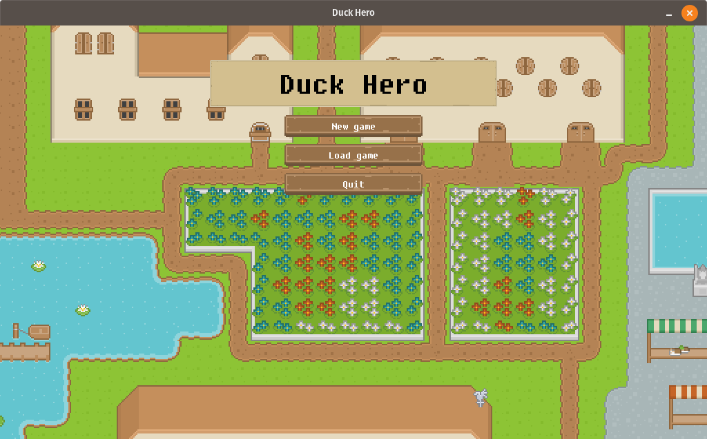
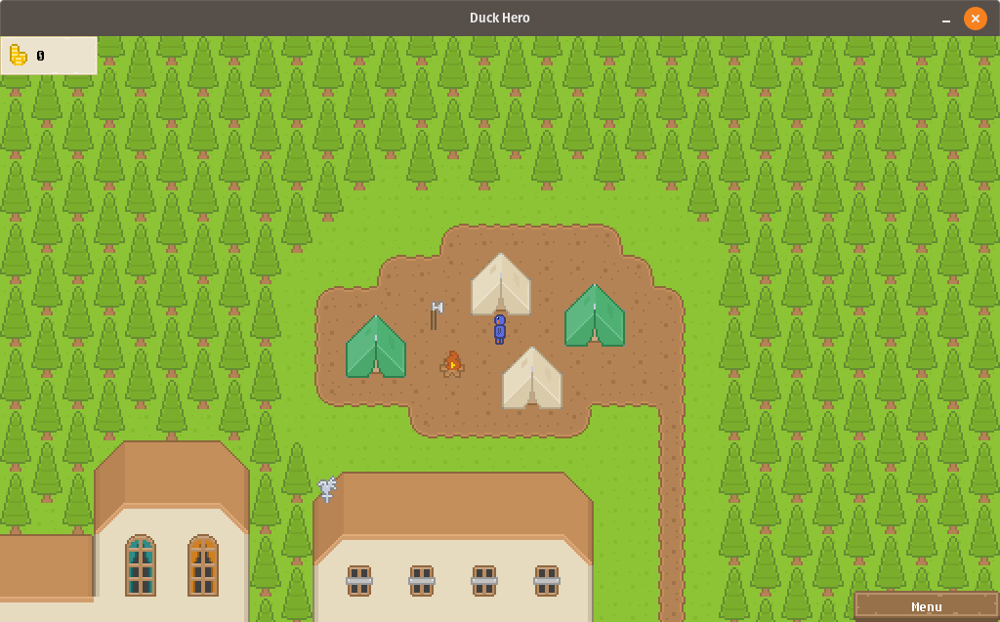
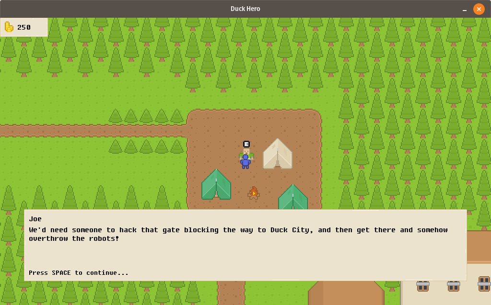
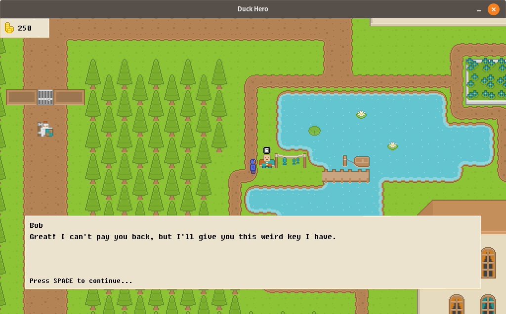
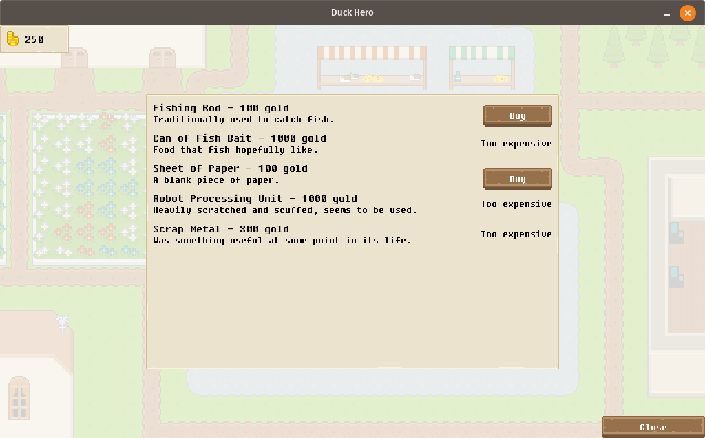
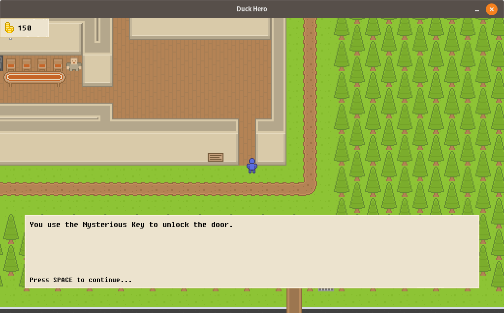
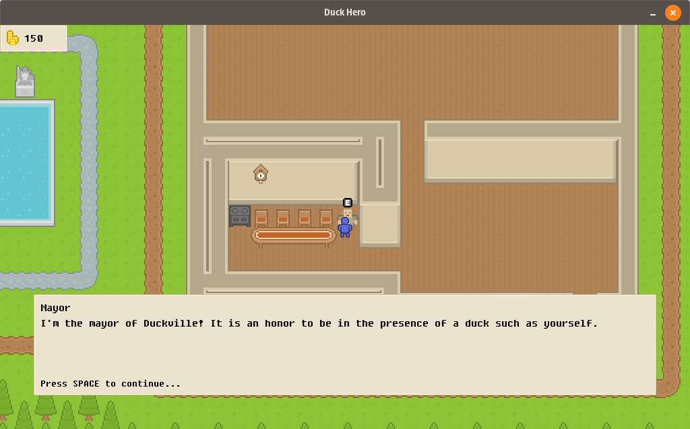
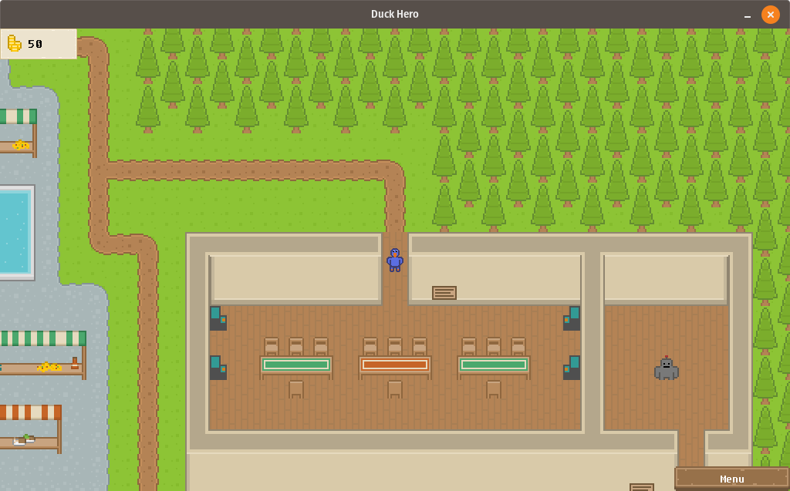
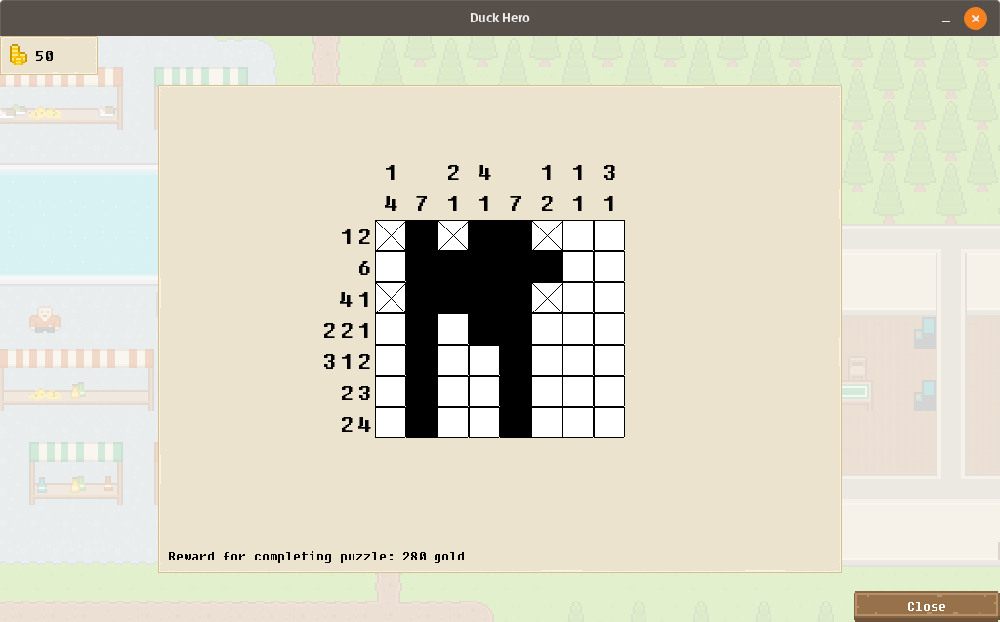

# Duck Hero

A 2D role-playing game written in C++ using the SDL2 library. You play as a duck named Ducky, saving the city of Duckville from the evil robots which have taken over.

The pugixml library is used to save and restore your progress in the game, and the PhysicsFS library is used to load game assets, such as images, dialogue lines, and sound.

The tile images come from [kenney.nl](https://www.kenney.nl/), although some (like Ducky) were drawn in [aseprite](https://www.aseprite.org/). The map layout was drawn in [Tiled](https://www.mapeditor.org/) and parsed with some custom code that makes use of pugixml.

## Additional screenshots
Click on a screenshot to expand it.

	
	
	
	
	
	
	
	

